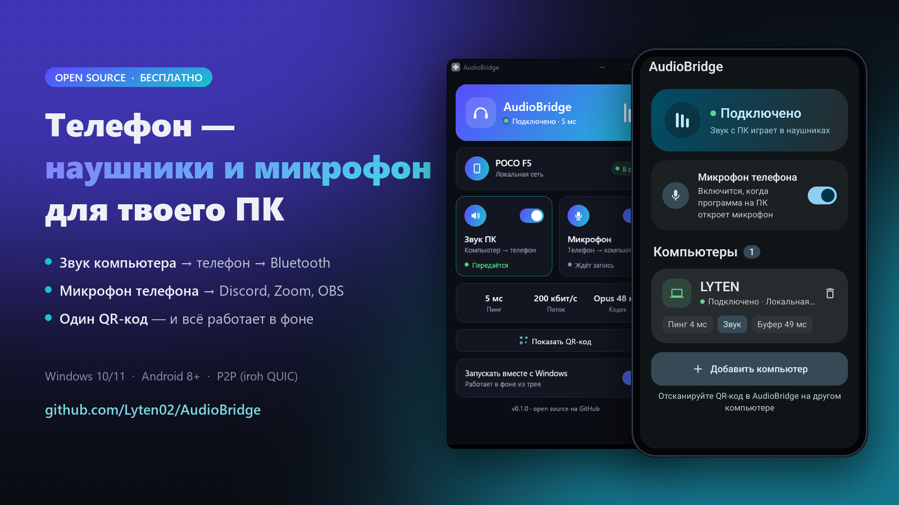
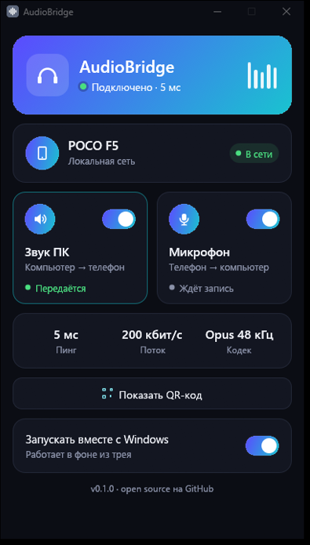
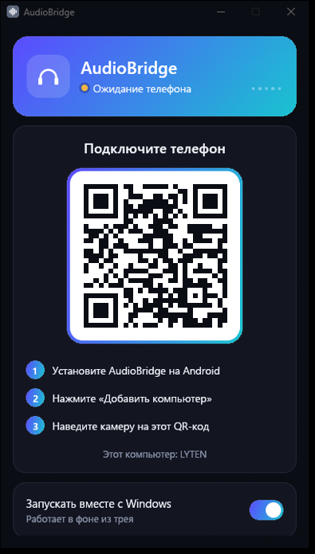
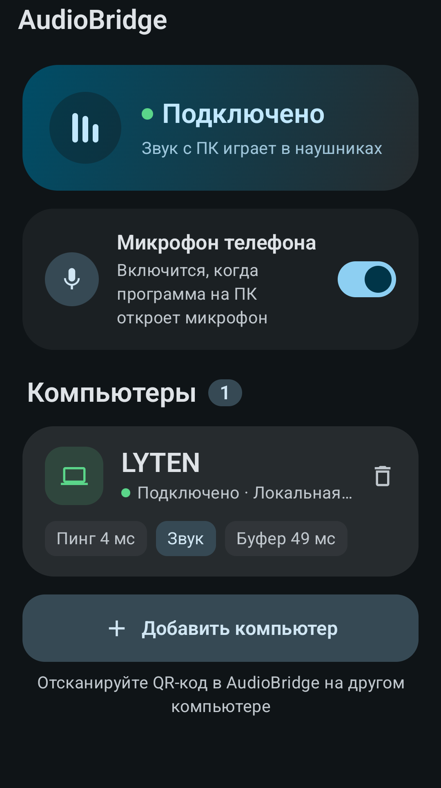

# AudioBridge



**Your phone becomes the wireless headphones and microphone of your Windows PC.**

AudioBridge streams everything your PC plays to your Android phone, which plays it in the Bluetooth headphones connected to the phone. In the other direction, the phone's microphone shows up on the PC as a regular microphone for Discord, Zoom, OBS or games.

Pair once by scanning a QR code. After that both apps run in the background, start on boot and reconnect by themselves. No accounts, no servers to configure, no IP addresses to type.

[Русская версия](README.ru.md)

<p align="center">
  
  &nbsp;
  
  &nbsp;
  
</p>

## Features

- **PC audio → phone → Bluetooth headphones.** Opus at 192 kbit/s stereo, 48 kHz. Around 30–40 ms of network latency on Wi-Fi; Bluetooth itself adds its usual 100–200 ms on top.
- **Phone mic → PC.** Shows up as `CABLE Output` (VB-CABLE). The phone only sends the mic while some app on the PC is actually recording.
- **One-scan pairing.** The PC shows a QR code, the phone scans it, and that's it.
- **Works across networks.** Peer-to-peer over [iroh](https://iroh.computer) QUIC: LAN, NAT hole punching, Tailscale, or an encrypted relay as a last resort. The phone and the PC don't need to share a Wi-Fi network.
- **Several PCs at once.** Pair up to 8 computers (desktop, laptop, …). Their audio is mixed, and the mic goes only to the ones that use it. Mute one PC, or all of them with a single button, right from the phone; they stay connected.
- **Full remote control from either side.** From the PC: PC and phone volume, the phone mic, and the Windows default mic. From the phone: the PC's audio and mic switches, its volume and mute. The PC's "Mic" switch does everything at once: it turns the phone mic on and makes `CABLE Output` the Windows default mic; switching it off restores your previous mic.
- **Headphone buttons control the music on the PC.** With the earbuds connected to the phone, double tap pauses/resumes and triple tap skips tracks in the PC's player (Yandex Music, Spotify, a browser — anything in the Windows media overlay), also with the phone screen off. With several PCs, the buttons control exactly one: the one playing, or the one you pick. A "Single earbud" mode lets you choose the 2- and 3-tap actions so either earbud alone can do everything. Volume taps keep changing the phone volume (what you hear): Android doesn't tell apps about them, so they can't be remapped.
- **Background and autostart** on both sides. Low CPU: about 1–2 % of one core on the PC, 4–5 % on the phone while playing.
- **PC service on/off:** «Выключить AudioBridge» in the window or tray disconnects this PC, stops audio and media integration, and restores non-CABLE default devices where available. «Включить AudioBridge» restores the saved feature settings and pairing without rescanning. Off stays off after restarting Windows; other PCs and the phone's switches are untouched. Closing the window only returns it to the tray; reopen it with the tray icon or another launch.
- **End-to-end encrypted** (QUIC/TLS) and authenticated by the pairing secret from the QR code.

## Requirements

| | |
|---|---|
| PC | Windows 10/11 x64 |
| Phone | Android 8.0+ (arm64) |
| Mic on PC | [VB-CABLE](https://vb-audio.com/Cable/) (free); the app offers to install it |

The UI is in Russian for now. Translations are welcome.

## Install

1. Download `AudioBridge.exe` and `AudioBridge.apk` from [Releases](https://github.com/Lyten02/AudioBridge/releases).
2. **PC:** run `AudioBridge.exe`. It installs itself to `%LOCALAPPDATA%\Programs\AudioBridge`, enables autostart and shows a QR code. Allow it through the Windows firewall.
3. **Phone:** install the APK, open it, tap «Добавить компьютер» (Add computer) and scan the QR code.
4. On Xiaomi/HyperOS/MIUI: enable Autostart for AudioBridge, set battery to "No restrictions" and lock the app in recents, or the system will kill it.

## How it works

```
PC   WASAPI loopback ─► Opus ─► QUIC datagrams ─► jitter buffer ─► AAudio ─► Bluetooth headphones   Phone
PC   VB-CABLE ◄─ jitter buffer ◄─ QUIC datagrams ◄─ Opus ◄─ AAudio mic                              Phone
```

- A shared Rust core (`crates/core`) does networking, Opus encoding and the receive path. The receive path is a small NetEQ-style jitter buffer: an adaptive delay target, packet-loss concealment and clock-drift compensation.
- `crates/desktop` is the Windows tray app (WASAPI + egui).
- `crates/android-native` is the JNI library (AAudio); `android/` is the Kotlin/Compose app with a foreground service.

See [AGENTS.md](AGENTS.md) for the detailed developer guide.

## Build from source

```powershell
cargo test -p audiobridge-core
cargo build -p audiobridge-desktop --release         # target\release\AudioBridge.exe
cd android; .\gradlew.bat :app:assembleDebug         # needs Android SDK, NDK r23 and cargo-ndk
```

Rust ≥ 1.92. Opus is vendored and built with `cc`, so you don't need cmake.

## Contributing

Pull requests are welcome. See [CONTRIBUTING.md](CONTRIBUTING.md).

## License

[MIT](LICENSE). Bundled libopus is BSD-3-Clause (`crates/opus-sys/opus/COPYING`).
