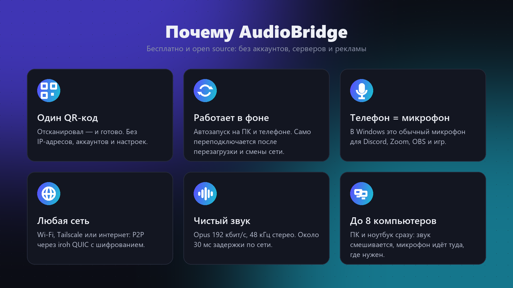

# AudioBridge


**Телефон становится беспроводными наушниками и микрофоном для компьютера с Windows.**

AudioBridge передаёт весь звук компьютера на Android-телефон, а тот играет его в Bluetooth-наушники, подключённые к телефону. В обратную сторону микрофон телефона появляется на ПК как обычный микрофон для Discord, Zoom, OBS и игр.

Один раз сканируешь QR-код. Дальше оба приложения работают в фоне, запускаются вместе с системой и сами переподключаются. Без аккаунтов, без серверов и без ввода IP-адресов.

[English version](README.md)

<p align="center">
  
  &nbsp;
  
  &nbsp;
  
</p>



## Возможности

- **Звук ПК → телефон → Bluetooth-наушники.** Opus 192 кбит/с, стерео, 48 кГц. Задержка сети по Wi-Fi около 30–40 мс; сам Bluetooth добавляет свои обычные 100–200 мс.
- **Микрофон телефона → ПК.** Виден как `CABLE Output` (VB-CABLE). Телефон отправляет микрофон, только когда какая-то программа на ПК действительно записывает.
- **Сопряжение одним сканом QR-кода.**
- **Работает между разными сетями.** P2P через [iroh](https://iroh.computer) QUIC: локальная сеть, пробой NAT, Tailscale, а в крайнем случае зашифрованный relay. Телефону и ПК не обязательно быть в одном Wi-Fi.
- **Несколько компьютеров сразу.** До 8 ПК (стационарный, ноутбук, …): их звук смешивается, а микрофон уходит только туда, где он нужен. Звук отдельного ПК или всех сразу можно выключить одной кнопкой прямо с телефона, связь при этом не рвётся.
- **Полный пульт с обеих сторон.** С ПК: громкость компьютера и телефона, микрофон телефона, выбор микрофона Windows. С телефона: звук и микрофон компьютера, его громкость и mute. Кнопка «Микрофон» на ПК делает всё сразу: включает микрофон на телефоне и ставит `CABLE Output` микрофоном Windows по умолчанию; выключение возвращает прежний микрофон.
- **Фон и автозапуск** на обеих сторонах. Нагрузка небольшая: на ПК 1–2 % одного ядра, на телефоне 4–5 % во время воспроизведения.
- **Сквозное шифрование** (QUIC/TLS) и проверка по секрету из QR-кода.

## Что нужно

| | |
|---|---|
| ПК | Windows 10/11 x64 |
| Телефон | Android 8.0+ (arm64) |
| Микрофон на ПК | [VB-CABLE](https://vb-audio.com/Cable/) (бесплатный), приложение предложит установить |

## Установка

1. Скачай `AudioBridge.exe` и `AudioBridge.apk` в [Releases](https://github.com/Lyten02/AudioBridge/releases).
2. **ПК:** запусти `AudioBridge.exe`. Программа сама установится в `%LOCALAPPDATA%\Programs\AudioBridge`, включит автозапуск и покажет QR-код. Разреши ей доступ в брандмауэре Windows.
3. **Телефон:** установи APK, открой и нажми «Добавить компьютер», отсканируй QR-код.
4. На Xiaomi/HyperOS/MIUI: включи AudioBridge автозапуск, батарею «Без ограничений» и закрепи приложение в недавних (замок). Иначе система будет его выгружать.

## Сборка из исходников

```powershell
cargo test -p audiobridge-core
cargo build -p audiobridge-desktop --release         # target\release\AudioBridge.exe
cd android; .\gradlew.bat :app:assembleDebug         # нужны Android SDK, NDK r23 и cargo-ndk
```

Подробное описание архитектуры — в [AGENTS.md](AGENTS.md). Pull request'ы приветствуются, см. [CONTRIBUTING.md](CONTRIBUTING.md).

## Лицензия

[MIT](LICENSE). Встроенная libopus распространяется под BSD-3-Clause.
